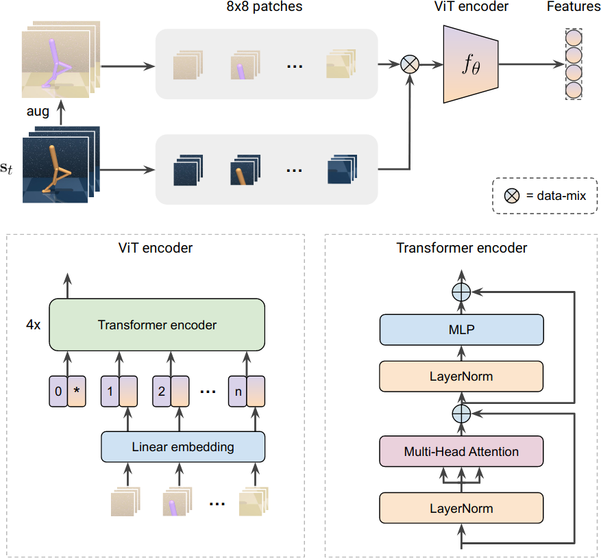

# SVEA: Stabilized Q-Value Estimation under Data Augmentation

This is a PyTorch implementation of **SVEA** using Vision Transformers from

**Stabilizing Deep Q-Learning with ConvNets and Vision Transformers under Data Augmentation**<br/>
[Nicklas Hansen](https://nicklashansen.github.io), [Hao Su](https://cseweb.ucsd.edu/~haosu), [Xiaolong Wang](https://xiaolonw.github.io).

[[Paper]](https://arxiv.org/abs/2107.00644) [[Webpage]](https://nicklashansen.github.io/SVEA)


See [this repository](https://github.com/nicklashansen/dmcontrol-generalization-benchmark) for SVEA implemented using ConvNets, as well as additional baselines and test environments.





## Citation
<a name="citation"></a>
If you find our work useful in your research, please consider citing our work as follows:

```
@article{hansen2021stabilizing,
  title={Stabilizing Deep Q-Learning with ConvNets and Vision Transformers under Data Augmentation},
  author={Nicklas Hansen and Hao Su and Xiaolong Wang},
  year={2021},
  eprint={2107.00644},
  archivePrefix={arXiv},
  primaryClass={cs.LG}
}
```


## Setup
We assume that you have access to a GPU with CUDA >=9.2 support. All dependencies can then be installed with the following commands:

```
conda env create -f setup/conda.yml
conda activate svea
sh setup/install_envs.sh
```


## Training & Evaluation

The `scripts` directory contains bash scripts for both SVEA and a DrQ baseline, which can be run by `sh scripts/svea.sh` and `sh scripts/drq.sh`, respectively.

Alternatively, you can call the python scripts directly, e.g. for training call

```
python3 src/train.py
```

to run SVEA on the default task, `walker_walk`, and using default hyperparameters. This should give you an output of the form:

```
Working directory: logs/walker_walk/svea/default/1
Evaluating: logs/walker_walk/svea/default/1
| eval | S: 0 | ER: 26.2285 | ERTEST: 25.3730
| train | E: 1 | S: 250 | D: 328.1 s | R: 0.0000 | ALOSS: 0.0000 | CLOSS: 0.0000 | AUXLOSS: 0.0000
```
where `ER` and `ERTEST` corresponds to the average return in the training and test environments, respectively. You can select the test environment used in evaluation with the `--eval_mode` argument, which accepts one of `(original, color_easy, color_hard, video_easy, video_hard)`. Note that training time is approximately 9 days for 500k frames.


## Acknowledgements

We want to thank the numerous researchers involved in work of which this implementation is based on. Our DrQ implementation is based on [this repository](https://github.com/denisyarats/drq), the original DMControl is available [here](https://github.com/deepmind/dm_control),  and the gym wrapper for it is available [here](https://github.com/denisyarats/dmc2gym). Data augmentations are based on [this](https://github.com/MishaLaskin/rad) repository and *kornia* which is available [here](https://github.com/kornia/kornia). Our ViT encoder is based on [this](https://github.com/rwightman/pytorch-image-models) implementation by Ross Wightman.